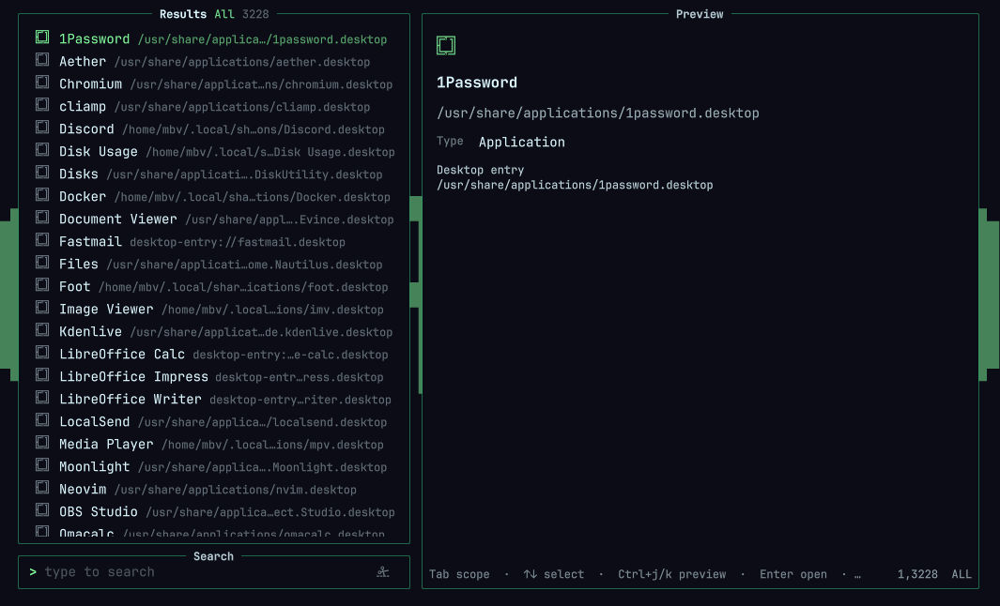

# OmniScope



Telescope-inspired search for the Omarchy shell. Search applications, files, and Omarchy launchers, with inline file previews.

## Install

```sh
omarchy plugin add https://github.com/mbvlabs/omniscope.git --enable
omarchy restart shell
```

That is the full install. The plugin ships a prebuilt Linux x86_64 `bin/omniscope-search` helper — no Rust toolchain and no build step.

## Usage

```sh
omarchy-shell shell summon io.github.mbvlabs.omniscope '{}'
```

Suggested keybinding in `~/.config/hypr/bindings.lua`:

```lua
o.bind("SUPER + SPACE", "OmniScope", "omarchy-shell shell summon io.github.mbvlabs.omniscope '{}'")
```

### Modes

- **All** — applications, files, and Omarchy launchers
- **Apps** — desktop applications only
- **Files** — fuzzy search across your home-directory file index
- **Launchers** — actions from your Omarchy menu configuration

`Tab` / `Shift+Tab` switch modes. Type to filter, arrows to move, `Enter` to open, `Escape` to close.

The search helper runs only while OmniScope is open. Closing the panel stops it and frees the in-memory index. Reopening indexes in the background; apps and launchers are available immediately. While open, the file index refreshes every 60 seconds.

The index includes hidden files, respects Git ignore rules, and skips `.git`, `node_modules`, and `.cache`. File queries match paths relative to `$HOME` with fuzzy, unordered words. Exact filenames and prefixes rank first. Results page in chunks of 100.

Only UTF-8 filenames are indexed. Application and launcher actions use Omarchy's existing launchers.

## Dependencies

| Command | Used for |
|---------|----------|
| `bin/omniscope-search` | Bundled indexing and fuzzy search (ships with the plugin) |
| `node` | File preview worker |
| `bat` | Syntax-highlighted text previews |
| `file` | MIME type detection |

On Omarchy, `bat` and `file` are usually present. Install `node` if you want file previews.

## Development

Rust is only needed when changing the search helper:

```sh
cargo test --locked
cargo clippy --locked --all-targets -- -D warnings
bash scripts/build-search.sh
node scripts/benchmark-search.mjs
```

`scripts/build-search.sh` rebuilds `bin/omniscope-search` into the plugin tree (compiler output under `~/.cache/omniscope/target`) and refreshes its committed digest `bin/omniscope-search.sha256`. Commit both files together so installs stay build-free. The pinned toolchain in `rust-toolchain.toml` is installed automatically by rustup; development also requires `objcopy` (binutils) for the deterministic ELF normalization.

### Supply-chain provenance

The shipped `bin/omniscope-search` is a reproducible release build of `src/`:

- `rust-toolchain.toml` pins the exact toolchain (`1.98.1`).
- `bin/omniscope-search.sha256` is the committed SHA-256 of the shipped binary.
- CI (`.github/workflows/build-search.yml`) runs `scripts/verify-search.sh`, which rebuilds from a clean checkout on Ubuntu 24.04 with SHA-pinned actions and **fails the push** whenever the shipped binary's digest does not match the freshly built binary — an unreviewed or tampered executable cannot ship.

After changing anything under `src/`, `Cargo.toml`, or `Cargo.lock`, run `bash scripts/build-search.sh` and commit `bin/omniscope-search` + `bin/omniscope-search.sha256` together.

The helper speaks newline-delimited JSON on stdin (`replace`, `search`, `refresh`, `cancel`) and writes `ready`, `indexed`, `results`, and `error` on stdout. Closing stdin stops it. No file index is written to disk.

## Remove

```sh
omarchy plugin remove io.github.mbvlabs.omniscope
```

## License

MIT — see [LICENSE](LICENSE).
